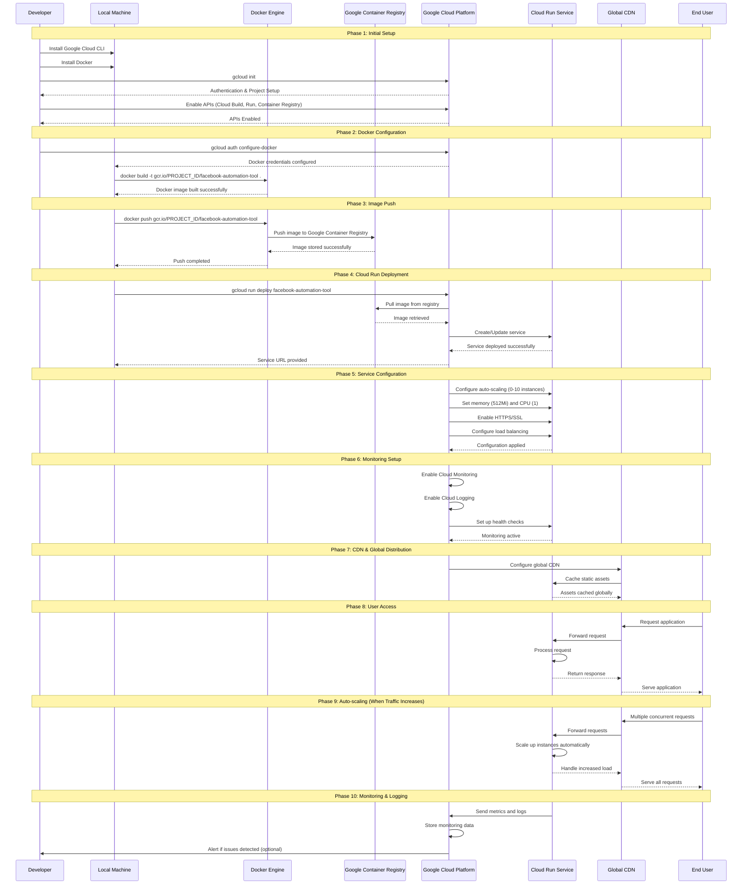
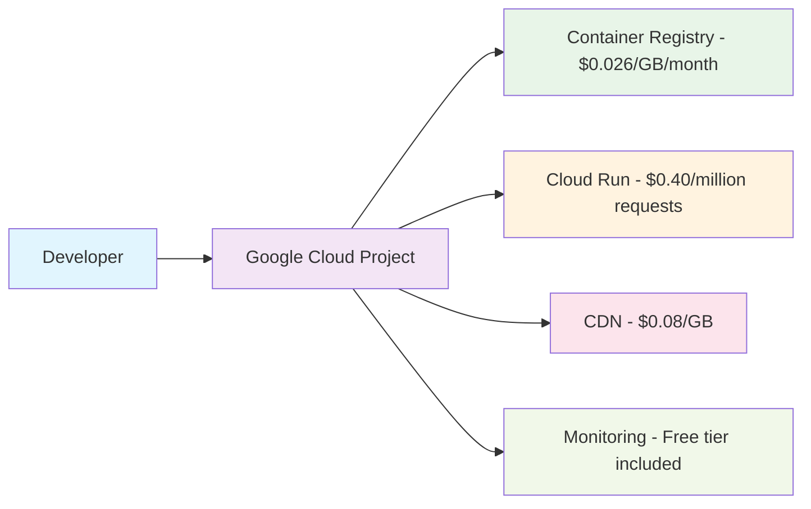
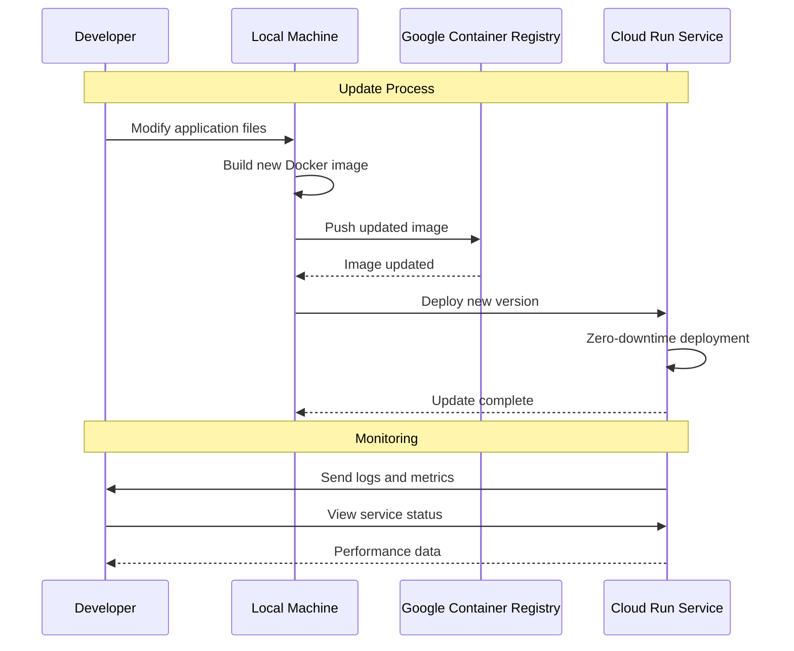

# Deployment Sequence Diagram

## Complete Google Cloud Deployment Process

## Detailed Process Breakdown

### Phase 1: Initial Setup
1. **Developer Setup**: Install Google Cloud CLI and Docker
2. **Authentication**: Initialize Google Cloud with project selection
3. **API Enablement**: Enable required Google Cloud APIs

### Phase 2: Docker Configuration
1. **Docker Auth**: Configure Docker to work with Google Cloud
2. **Image Build**: Build Docker image from local files
3. **Image Tagging**: Tag image for Google Container Registry

### Phase 3: Image Push
1. **Registry Push**: Upload Docker image to Google Container Registry
2. **Storage**: Image stored in Google's secure container registry

### Phase 4: Cloud Run Deployment
1. **Service Creation**: Deploy container to Cloud Run service
2. **Configuration**: Set up service parameters (memory, CPU, scaling)
3. **URL Generation**: Cloud Run provides public URL

### Phase 5: Service Configuration
1. **Auto-scaling**: Configure scaling parameters (0-10 instances)
2. **Resource Allocation**: Set memory and CPU limits
3. **Security**: Enable HTTPS/SSL certificates
4. **Load Balancing**: Configure traffic distribution

### Phase 6: Monitoring Setup
1. **Cloud Monitoring**: Enable monitoring and alerting
2. **Cloud Logging**: Enable centralized logging
3. **Health Checks**: Set up service health monitoring

### Phase 7: CDN & Global Distribution
1. **CDN Configuration**: Set up global content delivery network
2. **Asset Caching**: Cache static assets globally
3. **Performance**: Optimize for global users

### Phase 8: User Access
1. **Request Flow**: User requests → CDN → Cloud Run → Response
2. **Static Serving**: CDN serves cached content
3. **Dynamic Content**: Cloud Run processes dynamic requests

### Phase 9: Auto-scaling
1. **Traffic Detection**: Cloud Run monitors request volume
2. **Instance Scaling**: Automatically scale up/down based on demand
3. **Load Distribution**: Balance requests across instances

### Phase 10: Monitoring & Logging
1. **Metrics Collection**: Collect performance and usage metrics
2. **Log Aggregation**: Centralize all service logs
3. **Alerting**: Notify on issues or performance problems

## Key Benefits Illustrated

1. **No Local Resources**: Application runs entirely in Google Cloud
2. **Automatic Scaling**: Handles traffic spikes without manual intervention
3. **Global Performance**: CDN ensures fast loading worldwide
4. **High Availability**: Multiple instances and health checks
5. **Cost Optimization**: Pay only for actual usage
6. **Security**: Automatic SSL and secure container execution

## Cost Flow

## Time Estimates

- **Initial Setup**: 10-15 minutes
- **Docker Build**: 2-5 minutes
- **Image Push**: 1-3 minutes
- **Cloud Run Deployment**: 2-5 minutes
- **Total Deployment Time**: 15-28 minutes

## Maintenance Operations

This sequence diagram shows the complete journey from local development to a production-ready, globally distributed web application running entirely in the cloud! 🚀 